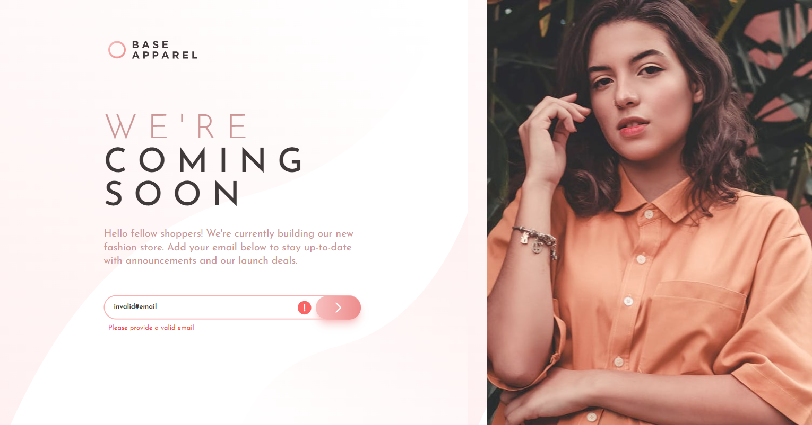
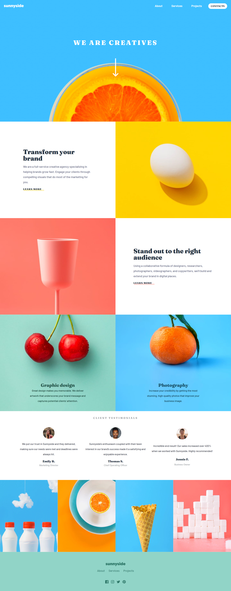
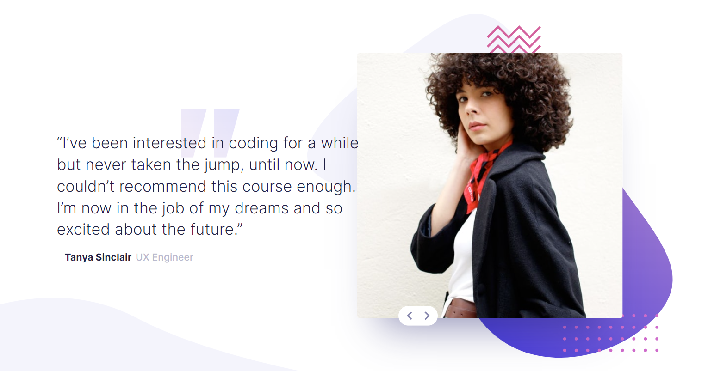
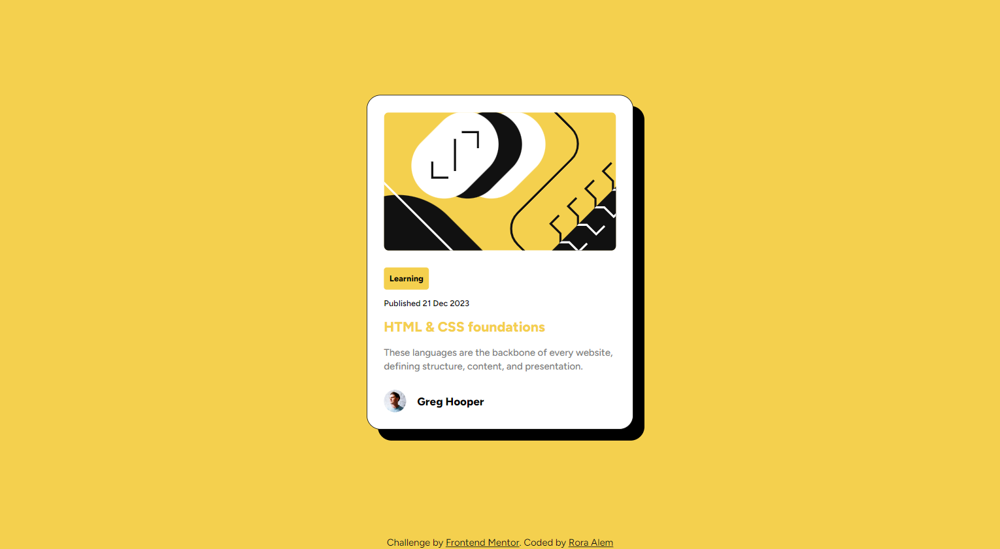

# Frontend Flow

This repository serves as a portfolio showcasing the front-end projects completed as part of the Frontend Friday challenges from Frontend Mentor challenges.

## Projects

Listed below are the front-end projects included in this portfolio:

### Task#001: **Result Summary Component**

       
   

   - **Description:** Create a results summary component with responsive layout, interactive hover/focus states, and optional dynamic population of content using local JSON data.

   - **Technologies Used:** HTML, CSS and JavaScript
   - **Live Demo:** [Click here](https://github.com/Rgit915/newsletter-sign-up-with-success-message)
   - **Code Repository:** [Click here](https://github.com/Rgit915/results-summary-component)

### Task#002: **Newsletter Signup form with success message**

       
   

   - **Description:** This project showcases basic form structure, validation, and submission skills. The success state will also be an excellent opportunity to work with DOM manipulation.
   - **Technologies Used:** ReactJs, Tailwind CSS and Formik library.
   - **Live Demo:** [Click here](newsletter-signup-rora-alem.netlify.app)
   - **Code Repository:** [Click here](https://github.com/Rgit915/newsletter-sign-up-with-success-message)

### Task#003: **Pod request access landing page**
   

       
   

   - **Description:** An early access landing page with custom form validation, ensuring users can receive error messages for empty or incorrectly formatted email inputs and view an optimal layout across different screen sizes, including interactive hover states.
   - **Technologies Used:** ReactJs, Tailwind CSS and Formik library.
   - **Live Demo:** [Click here](https://pod-request-access-landing-page-rora.netlify.app/)
   - **Code Repository:** [Click here](https://github.com/Rgit915/pod-request-access-landing-page)

### Task#004: **Space torusim multi-page website**
   

       
   

   - **Description:** This project is a multi-page space tourism website, designed to test and enhance your skills in building responsive and interactive web pages. The goal is to build the website to match the provided design as closely as possible.

   - **Technologies Used:** ReactJs, Tailwind CSS
   <!-- - **Live Demo:** [Click here]() -->
   - **Code Repository:** [Click here](https://github.com/Rgit915/space-tourism-website)

### Task#005: **Base apparel coming soon page**
   

       
   

   - **Description:** This project is a coming soon page for Base Apparel, designed to test and enhance your CSS skills with some interesting layout details. Additionally, you'll practice basic form validation. The goal is to build the page to match the provided design as closely as possible.
   - **Technologies Used:** ReactJs, Tailwind CSS
   - **Live Demo:** [Click here](https://base-apparel-coming-soon-rora.netlify.app/)
   - **Code Repository:** [Click here](https://github.com/Rgit915/base-apparel-coming-soon-page)

### Task#006: **Sunnyside agency landing page**
   

       
   

   - **Description:** This project is a landing page for an agency, focusing on testing and enhancing your HTML and CSS skills. The goal is to build the page to match the provided design as closely as possible. While the project mainly emphasizes layout and responsiveness, it also includes a small JavaScript component for toggling the mobile navigation menu.

   - **Technologies Used:** ReactJs, Tailwind CSS.
   - **Live Demo:** [Click here](https://sunnyside-agency-landing-page-rora.netlify.app/)
   - **Code Repository:** [Click here](https://github.com/Rgit915/sunnyside-agency-landing-page)

### Task#007: **Coding Bootcamp testimonals slider**
   

       
   

   - **Description:** This project is a landing page featuring a testimonials slider for a coding bootcamp. The challenge is to build the page and make it look as close to the provided design as possible. The project serves as a good practice for JavaScript, particularly for handling slide transitions and animations.
   - **Technologies Used:** ReactJs, Tailwind CSS.
   - **Live Demo:** [Click here](https://bootcamp-testimonal-slider-rora.netlify.app/)
   - **Code Repository:** [Click here](https://github.com/Rgit915/coding-bootcamp-testimonals-slider)

### Task#008: **Blog preview card**
   

       
   

   - **Description:** This project is a blog preview card, designed as a perfect challenge for beginners to practice and enhance their HTML and CSS skills. The goal is to build the card to match the provided design as closely as possible, focusing on fundamental concepts like HTML structure and the box model.
   - **Technologies Used:** HTML5, Tailwind CSS.
   - **Live Demo:** [Click here](https://rgit915.github.io/blog-preview-card/)
   - **Code Repository:** [Click here](https://github.com/Rgit915/blog-preview-card)
