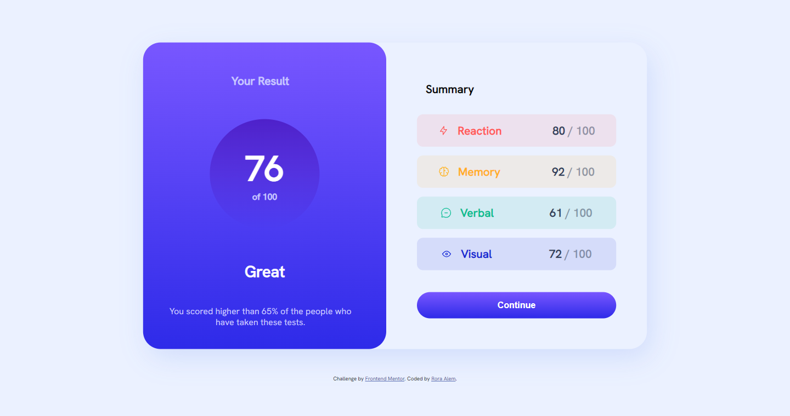
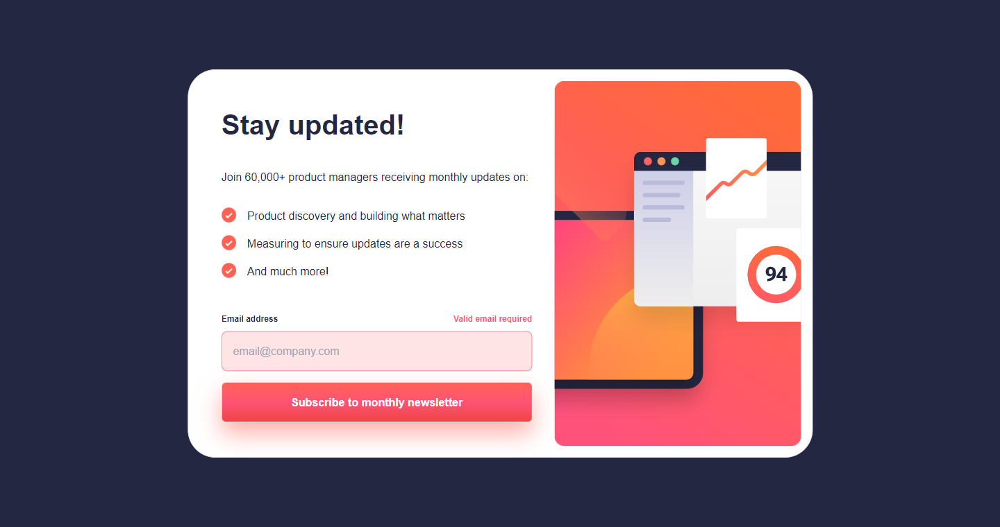
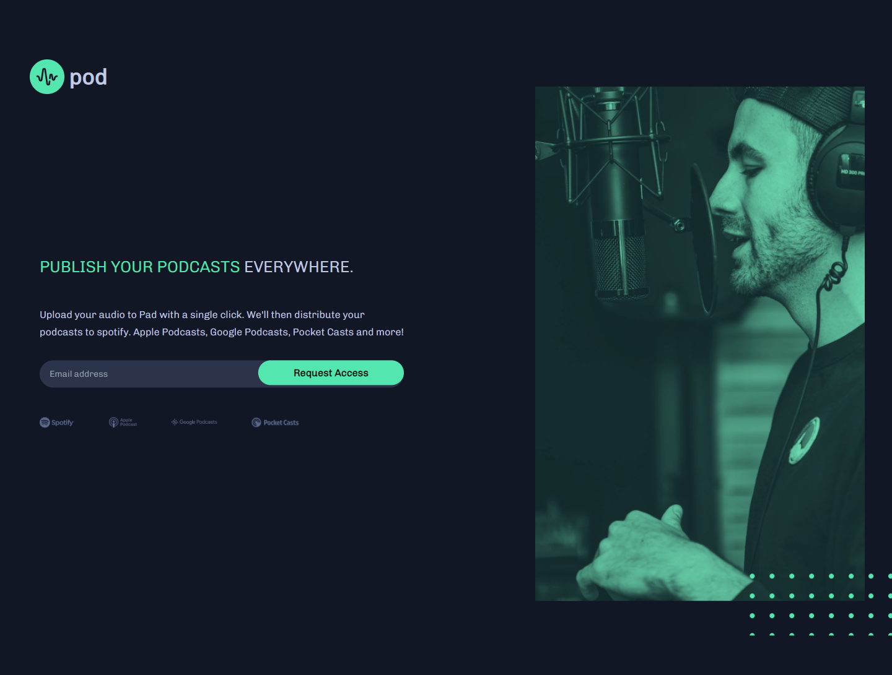

# Frontend Flow

This repository serves as a portfolio showcasing the front-end projects completed as part of the Frontend Friday challenges from Frontend Mentor challenges.

## Projects

Listed below are the front-end projects included in this portfolio:

### Task#001: **Result Summary Component**

       
   

   - **Description:** Create a results summary component with responsive layout, interactive hover/focus states, and optional dynamic population of content using local JSON data.

   - **Technologies Used:** HTML, CSS and JavaScript
   - **Live Demo:** [Click here](https://github.com/Rgit915/newsletter-sign-up-with-success-message)
   - **Code Repository:** [Click here](https://github.com/Rgit915/results-summary-component)

### Task#002: **Newsletter Signup form with success message**

       
   

   - **Description:** This project showcases basic form structure, validation, and submission skills. The success state will also be an excellent opportunity to work with DOM manipulation.
   - **Technologies Used:** ReactJs, Tailwind CSS and Formik library.
   - **Live Demo:** [Click here](newsletter-signup-rora-alem.netlify.app)
   - **Code Repository:** [Click here](https://github.com/Rgit915/newsletter-sign-up-with-success-message)

### Task#003: **Pod request access landing page**
   

       
   

   - **Description:** An early access landing page with custom form validation, ensuring users can receive error messages for empty or incorrectly formatted email inputs and view an optimal layout across different screen sizes, including interactive hover states.
   - **Technologies Used:** ReactJs, Tailwind CSS and Formik library.
   - **Live Demo:** [Click here](https://pod-request-access-landing-page-rora.netlify.app/)
   - **Code Repository:** [Click here](https://github.com/Rgit915/pod-request-access-landing-page)

